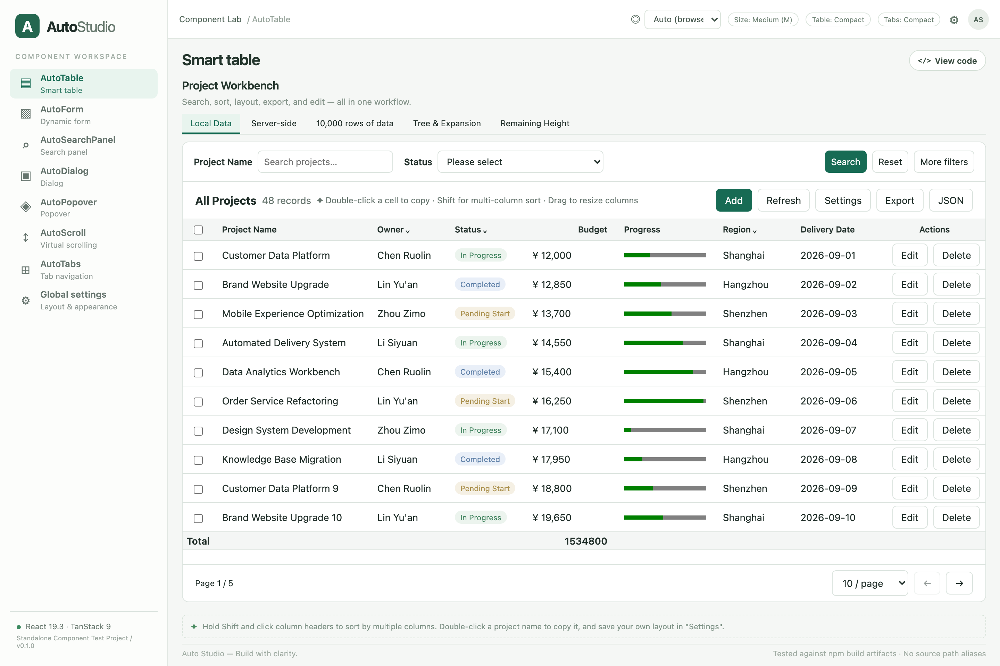

# React Auto Components

[English](../../../README.md) | [简体中文](../zh-CN/README.md) | [繁體中文](../zh-TW/README.md) | [日本語](../ja/README.md) | **한국어** | [Español](../es/README.md) | [Français](../fr/README.md) | [Deutsch](../de/README.md) | [Português (Brasil)](../pt-BR/README.md) | [Русский](../ru/README.md)

React 19를 위한 독립형 스키마 기반 컴포넌트 라이브러리로, 폼·표·채팅을 다룹니다. TypeScript, TanStack Table 9 / Form / Virtual, Radix, Floating UI로 구축되었으며 Ant Design, Element Plus, MUI는 사용하지 않습니다. 라이브러리 빌드에는 React Compiler를 사용합니다.

[](https://zeroman.github.io/react-auto-components/)

<p align="center">
  <a href="https://zeroman.github.io/react-auto-components/"><strong>🚀 온라인 데모 (GitHub Pages)</strong></a> · <a href="#독립형-테스트-프로젝트-실행">로컬 실행</a> · <a href="#컴포넌트">컴포넌트</a>
</p>

## 프로젝트 상태

현재 버전은 0.4.0이며 API는 아직 변경될 수 있습니다. React 19이 필요합니다. 이 패키지는 ESM 및 TypeScript 선언을 제공합니다. 내장 인터페이스 텍스트는 기본적으로 영어이며 AutoConfigProvider.config.t를 통해 번역할 수 있습니다.

`pnpm add @zeroman.yang/react-auto-components`로 설치합니다(npm과 yarn도 동일). peer dependency는 React 19와 react-dom 19입니다. 진입점에서 스타일시트를 한 번 불러오세요: `import "@zeroman.yang/react-auto-components/style.css"`.

앱 진입점에서 `import "@zeroman.yang/react-auto-components/style.css"`를 한 번 가져오세요. 스타일시트가 없으면 개발 모드에서 `RAC-CSS-MISSING`을 경고합니다.

XLSX 내보내기에서 `exportXlsx` 어댑터가 없으면 `RAC-TABLE-XLSX`, 선택적 의존성 `exceljs`를 불러올 수 없으면 `RAC-XLSX-DEP`입니다. `@zeroman.yang/react-auto-components/xlsx`에서 어댑터를 가져와 전달하고, 필요하면 `pnpm add exceljs`로 설치하세요. CSV와 JSON에는 필요하지 않습니다.

- [온라인 데모 (GitHub Pages)](https://zeroman.github.io/react-auto-components/)
- [기여 안내](https://github.com/Zeroman/react-auto-components/blob/main/docs/i18n/ko/CONTRIBUTING.md)
- [변경 기록](https://github.com/Zeroman/react-auto-components/blob/main/docs/i18n/ko/CHANGELOG.md)
- [계정 설정 및 게시](https://github.com/Zeroman/react-auto-components/blob/main/docs/i18n/ko/publishing.md)
- [MIT 라이선스](../../../LICENSE)

## 독립형 테스트 프로젝트 실행

Node.js >= 22.12와 pnpm 12.5가 필요합니다.

```sh
pnpm install --frozen-lockfile
pnpm prepare:test-project
pnpm --dir test-project dev
```

http://127.0.0.1:4173 을 엽니다. 테스트 프로젝트에는 7개 컴포넌트 모두의 페이지, 로컬/서버 측/10,000행/트리 테이블, CRUD, 제출 실패 후 재시도, 초안, 중첩 탭, 동적 행 높이 예제가 포함됩니다.

데모는 브라우저 언어를 자동으로 감지하며, 기본값으로 영어를 사용합니다. 헤더 또는 전역 설정(Global settings)에서 언어를 선택할 수 있으며, 선택한 언어는 새로고침 후에도 유지됩니다. Auto를 선택하면 다시 브라우저 언어를 따릅니다. 10개 언어가 지원됩니다. 페이지는 뷰포트를 채우며, 표와 긴 패널은 각자의 영역 내부에서 스크롤됩니다.

모든 예제 페이지에는 **코드 보기** 버튼이 있으며, 대화상자에서 실제 소스 파일을 엽니다. 파일 전환, 원클릭 복사, GitHub 링크를 지원합니다.

`test-project`에는 자체 package.json과 잠금 파일이 있습니다. 소스 별칭 없이 `pnpm pack`의 실제 결과물을 설치합니다. 라이브러리를 변경한 후에는 `pnpm prepare:test-project`를 다시 실행하세요. 스크립트는 콘텐츠 해시가 포함된 파일 이름을 사용하여 오래된 tarball 캐시를 방지합니다.

## 사용법

```tsx
import { useState } from 'react';
import {
  AutoConfigProvider, AutoDialogProvider, AutoTable,
  type AutoColumn, type Field,
} from '@zeroman.yang/react-auto-components';
import '@zeroman.yang/react-auto-components/style.css';

type Person = { id: number; name: string; enabled: boolean };
const columns: AutoColumn<Person>[] = [
  { key: 'name', label: '이름', sortable: true },
  { key: 'enabled', label: '활성화됨', options: [
    { label: '예', value: true }, { label: '아니요', value: false },
  ] },
];
const fields: Field<Person>[] = [
  { name: 'name', label: '이름', required: true },
  { name: 'enabled', label: '활성화됨', type: 'switch', defaultValue: true },
];
export function App() {
  const [rows, setRows] = useState<Person[]>([]);
  return <AutoConfigProvider config={{ namespace: 'my-app' }}>
    <AutoDialogProvider>
      <AutoTable<Person> id="people" rowKey="id" data={rows}
        columns={columns} formFields={fields} searchFields={fields}
        onAdd={value => setRows(old => [...old, { ...value, id: Date.now() }])}
        onEdit={(row, value) => setRows(old => old.map(item => item.id === row.id ? { ...row, ...value } : item))}
        onDelete={selected => setRows(old => old.filter(item => !selected.some(row => row.id === item.id)))}
      />
    </AutoDialogProvider>
  </AutoConfigProvider>;
}
```

필드, 열, ref는 제네릭을 사용하므로 잘못된 필드 이름이나 기본값은 컴파일 시 오류를 발생시킵니다. 프로바이더는 네임스페이스, 권한, 필드 레이블 번역, 사용자 정의 필드, 알림, 영속화 어댑터를 지원합니다. 내장 레이블, 유효성 검사 메시지, 접근성 텍스트는 AutoConfigProvider.config.t를 사용하며, 명시적으로 지정된 컴포넌트 레이블이 우선합니다.

t 콜백은 메시지 키와 폴백을 받습니다. 번역된 내장 메시지에서 {0}, {1}과 같은 번호가 매겨진 플레이스홀더는 그대로 유지해야 하며, 컴포넌트가 번역 후 값을 치환합니다.

## 컴포넌트

| 컴포넌트 | 기능 |
| --- | --- |
| AutoForm | 네이티브 필드 유형, 옵션 가상화, 계층형 선택, 업로드 어댑터, 사용자 정의 렌더링, 종속 필드, 조건부 표시, 비동기 유효성 검사, 제어 상태, 실패 후 입력 유지 |
| AutoSearch | 기본/고급 조건, 수동/즉시 검색, 초기화, 정렬 태그, 공유 쿼리 AST, RSQL 직렬화 |
| AutoTable | 로컬/원격 데이터, 다중 열 정렬, 열 필터, 페이지 나누기, 안정적인 선택 상태, 가상화, 트리/상세 펼치기, 집계, 셀 병합, CRUD, 컨텍스트 메뉴, 복사 |
| AutoDialog | 선언형/명령형 API, 격리된 프로바이더, 초안, 닫기 가드, 포커스 관리, 드래그, 전체 화면, 비동기 제출 |
| AutoTabs | 가로/세로 레이아웃, 중첩, 권한, 탭 비활성화, 패널 상태 유지, 새로 고침 |
| AutoMenu | 아이콘, 설명, 배지, 중첩 그룹, 권한, 접히는 아이콘 레일을 갖춘 사이드바 내비게이션 |
| AutoChat | 호출부 정의 메시지 렌더링, 선택적 가상화, 스트리밍 따르기, 앵커 기반 이력 로딩, 전송/정지 입력창, 사용자 지정 액션 |

테이블 레이아웃, 정렬, 필터링, 내보내기는 각각 이름이 있는 프리셋과 독립적인 버전을 지원합니다. 영속화는 기본적으로 localStorage를 사용하며 원격 어댑터를 주입할 수 있습니다. JSON/CSV 내보내기는 기본 제공됩니다. XLSX는 별도의 선택적 어댑터를 사용합니다.

```tsx
import { exportXlsx } from '@zeroman.yang/react-auto-components/xlsx';
// <AutoTable ... exportXlsx={exportXlsx} />
```

ExcelJS는 어댑터를 처음 사용할 때 동적으로 로드되며 라이브러리의 기본 진입점에서 제외됩니다. CSV/JSON만 사용하는 애플리케이션은 설치 시 선택적 종속성을 생략할 수 있습니다.

## 검증

```sh
pnpm typecheck
pnpm test
pnpm build
pnpm prepare:test-project
pnpm --dir test-project build
pnpm exec playwright install chromium  # 첫 실행 시에만
pnpm test:e2e
```

단위 테스트는 필드, 비동기 유효성 검사, 쿼리, 대화 상자, 가상화, 테이블, 설정 마이그레이션, 내보내기를 다룹니다. Playwright 테스트는 패키징된 공개 진입점을 통해 상호작용을 검사합니다. 데스크톱/모바일 스크린샷은 `test-project/test-results`에 저장됩니다.

## 동작 및 규칙

- React에 맞게 설계된 API이며 Vue의 속성이나 메서드를 하나씩 대응시키는 호환 계층이 아닙니다. [마이그레이션 가이드](migration.md)를 참고하세요.
- 데이터는 애플리케이션 코드가 관리합니다. CRUD 콜백에서 변경 사항을 영속화하며, 실패 시 예외를 던지면 편집 내용이 유지됩니다. 성공 후 컴포넌트는 원격 데이터를 새로 고칩니다. 로컬 데이터는 호출자가 업데이트해야 합니다.
- 테이블의 `id`는 네임스페이스 내에서 고유해야 하며, `rowKey`는 모든 페이지와 트리 노드에 걸쳐 고유해야 합니다. 서버 측 모드에서는 `columns`를 명시적으로 제공하며 데이터 소스는 전체 개수를 반환합니다.
- `query` / `value`를 제어하는 경우 부모가 콜백을 처리하고 해당 값을 업데이트해야 합니다. 비제어 방식에서는 이 props를 생략할 수 있습니다.
- 셀 병합은 가상 윈도 사이의 rowSpan 불일치를 방지하기 위해 가상화하지 않는 의미론적 테이블을 사용합니다. 페이지로 나눈 데이터에 적합합니다.
- 필터링된 모든 행의 서버 측 집계는 `summaryValues`로 제공합니다. 집계가 없으면 현재 페이지 합계를 전체 합계로 표시하지 않고 `—`를 표시합니다. 현재 페이지를 명시적으로 계산하려면 `summaryScope="page"`를 설정하세요.
- 업로드 중에는 제출을 일시 중지합니다. 초기화, 필드 값 교체, 마운트 해제 시 이전 업로드를 취소하며, 늦게 도착한 결과가 새 값을 덮어쓸 수 없습니다.
- 필터링된 모든 결과를 원격으로 내보낼 때는 한 페이지씩 데이터를 요청합니다. 대규모 애플리케이션은 자체 서버 측 내보내기를 구현할 수 있습니다.
- 브라우저 스타일은 `style.css`에서 명시적으로 가져오세요. JavaScript 모듈은 `window`가 없는 Node 환경에서도 가져올 수 있습니다.

## AutoTable로 남은 높이 채우기

`height={440}`은 기존처럼 데이터 스크롤 영역에 고정 높이를 설정합니다. `height="auto"`를 사용하면 테이블 전체가 부모 레이아웃이 할당한 높이를 채웁니다. 검색 영역, 도구 모음, 페이지 나누기는 자연스러운 높이를 차지하고, 데이터 영역이 남은 공간을 사용하여 독립적으로 스크롤됩니다.

```tsx
<div style={{ height: '100dvh', display: 'flex', flexDirection: 'column', gap: 12 }}>
  <header>페이지 제목 및 설명</header>
  <AutoTable<Person> id="people" rowKey="id" data={rows}
    columns={columns} height="auto" />
  <footer>페이지 푸터</footer>
</div>
```

부모에는 확정된 높이가 있어야 합니다. 중첩 flex 컨테이너에서는 `flex: 1; min-height: 0`을 사용하여 남은 공간을 전달하고, grid 레이아웃에서는 `grid-template-rows: auto minmax(0, 1fr) auto`를 사용하세요. JavaScript로 뷰포트 높이에서 도구 모음 높이를 뺄 필요가 없습니다. 검색 필드 추가/제거, 도구 모음 줄바꿈, 부모 크기 변경은 레이아웃이 처리하며, 가상 목록은 스크롤 영역의 실제 크기를 따릅니다.

이 설정은 행 수에 따라 테이블 크기를 조정하지 않습니다. 비어 있거나 작은 데이터셋도 사용 가능한 공간을 채웁니다. 부모는 적어도 검색 영역, 도구 모음, 페이지 나누기 자체를 수용할 수 있어야 합니다.

테스트 프로젝트의 **AutoTable → 남은 높이** 탭에서 사이드바와 페이지 헤더를 유지하는 예제를 볼 수 있습니다. 기존 URL `http://127.0.0.1:4173/?demo=auto-height`은 해당 탭을 바로 선택합니다. 브라우저 테스트: `test-project/tests/auto-height.spec.ts`.

## 전역 폼 레이아웃

`AutoConfigProvider.config.form`으로 일반 폼, 검색 패널, 테이블 검색 영역, 대화 상자 폼을 일관되게 설정하세요. 레이블은 컨트롤 위나 왼쪽에 배치할 수 있으며 텍스트의 왼쪽/오른쪽 정렬을 독립적으로 지정할 수 있습니다. 기본값은 상단 레이블과 여유 있는 간격입니다.

```tsx
<AutoConfigProvider config={{
  form: {
    labelPosition: 'left', // 'top': 위쪽; 'left': 컨트롤 왼쪽
    labelAlign: 'right',   // 텍스트는 오른쪽 정렬, 레이블은 컨트롤 왼쪽에 위치
    labelWidth: 80,
    density: 'compact',   // 'comfortable': 간격 넓힘
  },
}}>
  <App />
</AutoConfigProvider>
```

중첩된 프로바이더는 레이아웃 설정을 속성별로 병합합니다. 컴포넌트에 명시한 props가 바깥쪽 프로바이더보다 우선합니다. 예를 들어 전역에서는 인라인 레이블을 사용하면서 특정 폼에서는 상단 레이블을 유지할 수 있습니다.

```tsx
<AutoForm fields={fields} labelPosition="top" density="comfortable" />
<AutoTable id="people" rowKey="id" data={rows} columns={columns}
  searchFields={searchFields}
  searchLayout={{ labelWidth: 100, columns: 3 }} />
```

`labelWidth`의 기본값은 `"auto"`이며 픽셀 숫자나 `"6em"` 같은 CSS 너비도 받습니다. 자동 모드에서는 각 검색 레이블이 텍스트에 맞는 너비를 사용하고, 일반 폼과 대화 상자 폼은 표시된 레이블을 기준으로 공통 너비를 사용하여 컨트롤을 정렬합니다. 긴 레이블은 필드 너비의 최대 45%를 차지하고 그 이상은 줄바꿈하여 컨트롤 공간을 확보합니다. 명시적으로 고정한 너비에는 이 자동 제한이 적용되지 않습니다. 조밀한 검색 영역에서는 공간이 허용되면 동작 버튼을 같은 줄에 배치하고 좁은 화면에서는 줄바꿈합니다. 레이블 연결이 유지되고 오류와 설명이 컨트롤에 정렬되며 긴 레이블은 줄바꿈할 수 있습니다.

데모에서 사이드바 또는 오른쪽 위 톱니바퀴를 통해 **전역 설정** 을 열어 레이아웃, 밀도, 레이블 너비, 테마를 변경하세요. 현재 입력을 지우지 않고 변경 사항이 즉시 적용됩니다. 폼 페이지는 **전역 설정 따르기** 또는 로컬 재정의를 지원합니다. 데모는 프로바이더를 통해 조밀한 인라인 레이아웃을 명시적으로 활성화합니다.

## 전역 크기 및 밀도

`AutoConfigProvider`는 `size: "small" | "medium" | "large"`와 `density: "compact" | "comfortable"`을 지원합니다. 컴포넌트에 명시한 props가 컴포넌트 유형별 설정보다 우선하며, 유형별 설정은 전역 값보다 우선합니다.

```tsx
<AutoConfigProvider config={{
  size: "medium",
  density: "compact",
  form: { labelPosition: "left", labelAlign: "right" },
  table: { density: "compact" },
  tabs: { density: "compact" },
}}>
  <AutoForm fields={fields} size="small" />
</AutoConfigProvider>
```

테이블 밀도는 `normal`도 지원합니다. 테이블 설정 패널은 기본적으로 전역 설정을 따릅니다. 조밀함, 보통, 여유로운 간격을 선택하면 전역 밀도를 재정의하고 레이아웃 프리셋과 함께 저장합니다. 컴포넌트의 `density` prop이 가장 높은 우선순위를 갖습니다. 중첩 컴포넌트의 로컬 크기는 각각 독립적으로 적용됩니다.

폼은 `resetLabel`, `extraActions`, `onReset`을 지원하고, 검색 패널은 `searchLabel`, `resetLabel`, `extraActions`를 지원하며, 대화 상자는 `cancelLabel`, `extraActions`를 지원합니다. `AutoTabs` 항목에는 `badge`를 정의할 수 있고, `AutoTable.empty`로 빈 상태 콘텐츠를 사용자 정의할 수 있습니다.

### AutoChat

AutoChat은 스트리밍 따라가기, 기록 불러오기, 작성기를 갖춘 가벼운 대화 레이아웃을 제공합니다. 메시지 렌더링을 위해 React 콘텐츠나 renderMessage를 전달하면 되며, 추가 런타임 의존성이 필요하지 않습니다.

[AutoChat API](auto-chat.md)

콜백이 throw 된 뒤 컴포넌트가 어떻게 동작하는지는 동작 계약을 보세요: [AutoForm](auto-form.md), [AutoSearch](auto-search.md), [AutoTable](auto-table.md), [AutoDialog](auto-dialog.md), [AutoTabs](auto-tabs.md), [AutoMenu](auto-menu.md). 개발자 오류 코드: [errors.md](errors.md).
